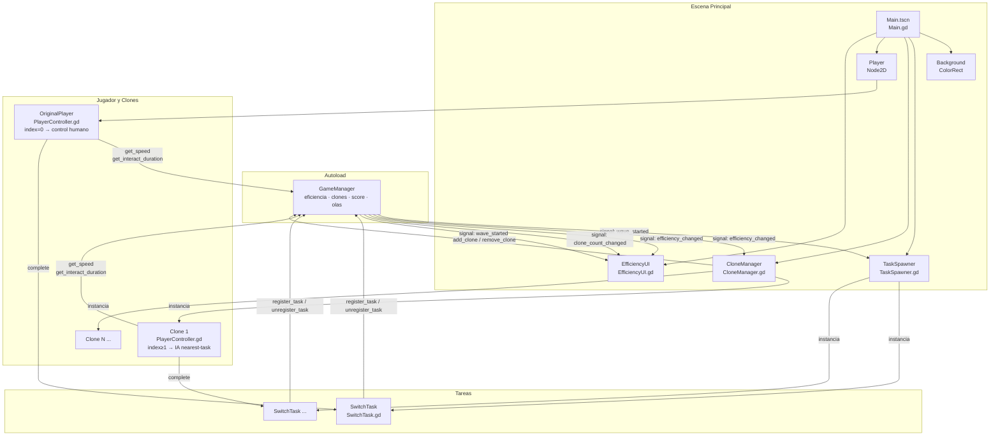
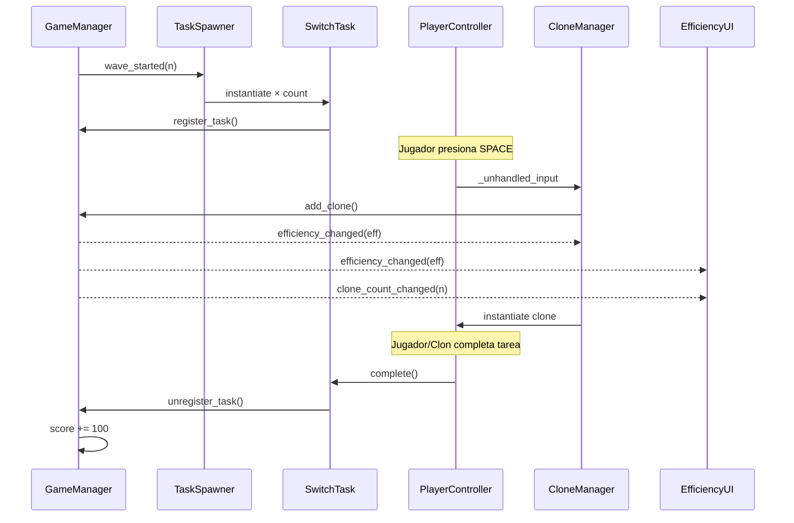

# Plan: README.md de OverSplit

## Objetivo
Crear el archivo `README.md` en la raíz del proyecto documentando todo lo que existe hasta el momento: concepto del juego, reglas, controles, arquitectura técnica, estructura de archivos y diagrama Mermaid.

---

## Contenido del README a generar

### 1. Cabecera
- Título: **OverSplit**
- Subtítulo / tagline: *"Cuantas más cosas haces al mismo tiempo, peor las haces."*
- Motor: Godot 4.6.1 · GDScript · GL Compatibility

---

### 2. Concepto del juego
- Descripción de la idea central: el jugador puede clonarse para atender múltiples tareas en paralelo, pero cada clon reduce la eficiencia global de todos.
- Mensaje temático del juego.

---

### 3. Reglas y mecánicas

#### Core Loop
- Aparecen tareas (switches) en la arena distribuidas aleatoriamente.
- El jugador se acerca a una tarea y presiona `E` para interactuar; hay una barra de progreso que se llena.
- Si el tiempo de la tarea se agota antes de completarla, la tarea falla.
- Completar todas las tareas de la ola otorga bonus de score.

#### Sistema de Clones
| Acción | Tecla |
|---|---|
| Crear clon | `SPACE` |
| Eliminar último clon | `Q` |
| Interactuar (jugador) | `E` |
| Mover jugador | `WASD` / Flechas |

- Máximo de clones: **6** (incluyendo el original = máx 6 entidades totales).
- Los clones se mueven solos hacia la tarea incompleta más cercana y la interactúan automáticamente.
- Los clones aparecen con colores distintos: Cyan, Amarillo, Verde, Naranja, Magenta.

#### Fórmula de Eficiencia
```
eficiencia = 1 / n        (n = número de clones activos, mínimo 1)
```

Tabla de impacto:

| Clones | Eficiencia | Velocidad | Tiempo de interacción |
|--------|-----------|-----------|----------------------|
| 1 | 100% | 180 px/s | 1.0 s |
| 2 | 50% | 90 px/s | 2.0 s |
| 3 | 33% | 60 px/s | 3.0 s |
| 4 | 25% | 45 px/s | 4.0 s |
| 5 | 20% | 36 px/s | 5.0 s |
| 6 | 16% | 30 px/s | 6.0 s |

#### Sistema de Olas
- Una nueva ola se inicia cada **20 segundos** automáticamente.
- La ola `n` genera `min(n + 1, 6)` tareas, escalonadas 0.5 s entre sí.
- Cada tarea tiene un timeout aleatorio entre **10 y 20 segundos**.
- Si se completan **todas** las tareas de la ola: bonus `ola × 500` puntos.
- Completar una tarea individual: **+100 puntos**.

#### Feedback visual de eficiencia
- Barra HUD: verde (>60%) → amarillo (35–60%) → rojo (<35%).
- Transparencia de todos los sprites: disminuye con la eficiencia (`alpha = lerp(0.3, 1.0, eficiencia)`).
- Flash blanco en todos los clones al crear uno nuevo.
- Vibración del panel HUD cuando eficiencia < 25%.
- Las tareas pulsan (escala 1.0 ↔ 1.1) para indicar urgencia.
- Al completar: explosión verde + desaparece. Al fallar: fade rojo + desaparece.

---

### 4. Estructura del proyecto

```
OverSplit/
├── project.godot               ← Configuración del proyecto, inputs, autoload
├── scenes/
│   ├── Main.tscn               ← Escena raíz
│   ├── Player.tscn             ← Jugador / clon (CharacterBody2D)
│   ├── SwitchTask.tscn         ← Tarea interactuable con timer
│   └── ui/
│       └── EfficiencyUI.tscn   ← HUD de eficiencia, score, ola
└── scripts/
    ├── GameManager.gd          ← Autoload: estado global y señales
    ├── Main.gd                 ← Bootstrap: conecta CloneManager con el jugador original
    ├── PlayerController.gd     ← Movimiento + interacción (humano o IA)
    ├── CloneManager.gd         ← Instancia/elimina clones, efectos visuales
    ├── SwitchTask.gd           ← Lógica de tarea: timer, éxito/fallo, animaciones
    ├── TaskSpawner.gd          ← Spawner de tareas por ola
    └── EfficiencyUI.gd         ← HUD reactivo a señales del GameManager
```

---

### 5. Arquitectura — Diagrama Mermaid



---

### 6. Flujo de señales



---

### 7. Constantes clave (`GameManager.gd`)

| Constante | Valor | Descripción |
|---|---|---|
| `MAX_CLONES` | 6 | Máximo de entidades totales |
| `BASE_SPEED` | 180.0 | Velocidad base en píxeles/segundo |
| `BASE_INTERACT_TIME` | 1.0 | Duración base de interacción en segundos |
| `WAVE_INTERVAL` | 20.0 | Segundos entre olas |

---

### 8. Inputs definidos en `project.godot`

| Input action | Tecla física |
|---|---|
| `create_clone` | `SPACE` |
| `remove_clone` | `Q` |
| `interact` | `E` |
| Movimiento | `ui_up/down/left/right` (WASD + Flechas) |

---

## Paso de implementación

1. Crear `README.md` en `C:\Users\Carlos\.verdent\verdent-projects\OverSplit\README.md` con todo el contenido descrito arriba.

---

## Verificación / DoD

| Paso | Archivo | Verificación |
|---|---|---|
| 1 | `README.md` | El archivo existe en la raíz del proyecto con todas las secciones |
| 1 | `README.md` | El bloque Mermaid de arquitectura renderiza correctamente |
| 1 | `README.md` | El bloque Mermaid de secuencia renderiza correctamente |
| 1 | `README.md` | La tabla de eficiencia y las constantes coinciden con los valores reales del código |
