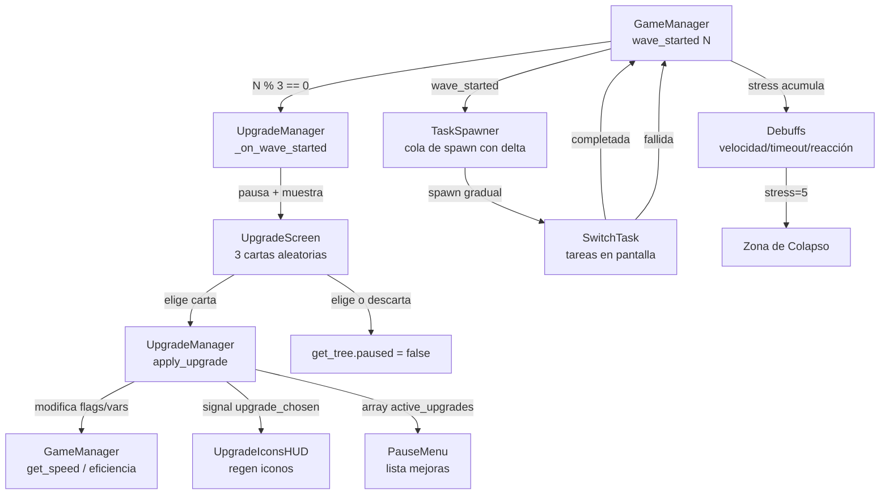

# OverSplit

**Versión:** v10.0 beta  
**Motor:** Godot 4.6 (GDScript)  
**Género:** Puzzle / Gestión / Roguelite

---

## Concepto

> *"Cuantas más cosas haces al mismo tiempo, peor las haces."*

OverSplit es un prototipo de game jam donde el jugador puede clonarse para atender múltiples tareas simultáneas, pero cada clon reduce la eficiencia global. La clave está en decidir cuándo vale la pena dividirse y cuándo concentrarse.

---

## Cómo jugar

### Controles

| Acción | Tecla |
|---|---|
| Mover | Flechas / WASD |
| Crear clon | SPACE |
| Eliminar clon | Q |
| Interactuar / Asignar tarea | E (en rango) |
| Click en tarea | Asignar prioridad a clones |
| Click derecho en tarea | Quitar prioridad |
| Pausar | ESC / Botón Pausa |
| Velocidad del juego | Botón x1 / x1.5 / x2 |
| Saltar oleada | Botón Skip |

### Loop principal

1. Aparecen tareas (cuadrados) con un temporizador — hay que completarlas antes de que expiren
2. Interactuar con una tarea la completa progresivamente; varios clones en la misma tarea la completan más rápido
3. Cada ola es más difícil: más tareas, menos tiempo
4. Cada 3 olas se puede elegir una mejora (upgrade)

---

## Sistema de eficiencia

La eficiencia base se calcula según el número de clones activos:

```
eficiencia = 1 - (clones - 1) × 0.156
```

| Clones | Eficiencia base |
|---|---|
| 1 | 100% |
| 2 | 84% |
| 3 | 69% |
| 4 | 53% |
| 5 | 38% |
| 6 | 22% |

La eficiencia afecta la **velocidad de movimiento** de todos los clones.  
Los upgrades pueden modificar este comportamiento (ver catálogo de mejoras).

---

## Sistema de estrés y colapso

Fallar tareas acumula **estrés** (máx. 5). Cada nivel aplica un debuff acumulativo:

| Estrés | Efecto |
|---|---|
| 1 | −5% velocidad |
| 2 | −1s timeout de tareas |
| 3 | +0.3s delay de reacción de clones |
| 4 | −10% eficiencia global |
| 5 | **Zona de Colapso** — efectos caóticos activos |

Completar **3 tareas seguidas** sin fallar reduce el estrés en 1.

### Zona de Colapso
Cuando el estrés llega al máximo, la pantalla señaliza el estado crítico. El juego no termina automáticamente — es un **game over emergente**. El jugador puede recuperarse reduciendo el estrés.

---

## Sistema de oleadas

- Las oleadas inician automáticamente cada **20s** (se reduce con el tiempo, mínimo 7s)
- La dificultad sube con cada oleada: más tareas, menos tiempo, más trabajo por tarea
- Las tareas tienen **tamaño variable** según su cantidad de trabajo restante
- Un **glow/sombra** crece a medida que la tarea tiene más vida
- Si la tarea está urgente (poco tiempo), **pulsa** visualmente
- Si la tarea requiere más clones de los asignados, aparece un **badge dorado** con el número recomendado

| Oleada | Dificultad |
|---|---|
| 1–2 | Fácil |
| 3–5 | Normal |
| 6–9 | Difícil |
| 10+ | CAOS |

---

## Sistema de mejoras (Roguelite)

Cada **3 oleadas** se pausa el juego y se presentan **3 cartas aleatorias** del catálogo.  
El jugador elige una; las otras 2 se descartan y no vuelven a aparecer en esa run.  
No hay límite de tiempo — se puede leer tranquilo.

Cada carta muestra icono, nombre, categoría y descripción corta.  
Un botón **"Ver detalle"** expande la descripción completa inline.

### Catálogo completo

#### Velocidad
| Icono | Nombre | Efecto |
|---|---|---|
| ⚡ | Adrenalina | +60% vel. base, −10% efic. extra por clon |
| 🎯 | Enfoque | +80% vel. con 1 clon, −50% con 2+ |
| 🚶 | Caravana | +30% vel. en grupo, −20% en solitario |

#### Interacción
| Icono | Nombre | Efecto |
|---|---|---|
| 💧 | Torrente | x1.5 progreso con 2+ clones en misma tarea, −30% solo |
| 💨 | Impulso | 1ra interacción de cada ola instantánea, −20% las siguientes |
| 🔥 | Constancia | Interacción sin cortes sube hasta x2, reset al interrumpir |

#### Clones
| Icono | Nombre | Efecto |
|---|---|---|
| 🛡 | Ejército Mínimo | 100% efic. con 1–2 clones, máx clones = 3 |
| 👥 | Proliferación | Máx clones = 8, efic. mínima = 8% |
| 💀 | Sacrificio | +300 pts al eliminar clon, −200 pts al crear |

#### Tareas
| Icono | Nombre | Efecto |
|---|---|---|
| 💥 | Sobrecarga | +150 pts por fallo, pero spawnea 1 tarea extra |
| ⛓ | Cadena | +3s a todas al completar, −5s a todas al fallar |
| 🎲 | Efecto Dominó | x2 score con racha de 2, reset al fallar |

#### Eficiencia
| Icono | Nombre | Efecto |
|---|---|---|
| 🌀 | Caos Controlado | Tareas urgentes x3 pts, sin urgencia = 0 pts extra |
| 😌 | Zona de Confort | Sin penaliz. hasta 4 clones, caída x2 con 5–6 |
| 🔀 | Caos Productivo | +500 pts cada 10s con efic.<30% |
| 📊 | Umbral | Efic. nunca baja del 40%, máximo = 80% |

#### Meta
| Icono | Nombre | Efecto |
|---|---|---|
| 🔄 | Segunda Oportunidad | Recupera 1 tarea fallida (1 vez), elimina todos los clones |
| ⌛ | Reloj de Arena | Ola no inicia hasta limpiar todo, −4s timeout próxima ola |

---

## HUD en pantalla

- **Eficiencia** — porcentaje actual (esquina superior)
- **Score** — puntuación acumulada
- **Oleada** — número y dificultad actual
- **Estrés** — barra de 0 a 5 con indicador de Zona de Colapso
- **Iconos de mejoras activas** — esquina inferior derecha; hover muestra descripción breve, click muestra detalle completo

---

## Menú de pausa

Accesible con **ESC** o el botón de pausa en pantalla.

- Botón **Reanudar**
- Botón **Volver al menú**
- Sección **Mejoras activas**: lista con icono, nombre y descripción corta de cada upgrade elegido; click en una fila expande la descripción completa

---

## Menú principal

- **Jugar** — inicia una nueva run
- **Catálogo de mejoras** — vista previa de todos los upgrades disponibles antes de jugar, organizados por categoría con nombre, icono y descripción completa

---

## Arquitectura del proyecto

```
OverSplit/
├── scenes/
│   ├── Main.tscn               # Escena principal de juego
│   ├── MainMenu.tscn           # Menú principal
│   ├── Player.tscn             # Jugador + sistema de clones
│   ├── SwitchTask.tscn         # Tarea interactuable
│   ├── UpgradeScreen.tscn      # Pantalla de elección de mejoras
│   └── ui/
│       ├── EfficiencyUI.tscn   # HUD de eficiencia, score, oleada, estrés
│       ├── PauseMenu.tscn      # Menú de pausa con lista de mejoras
│       └── UpgradeIconsHUD.tscn # Iconos de upgrades activos
│
└── scripts/
    ├── GameManager.gd          # Autoload — estado global, clones, oleadas, estrés
    ├── UpgradeManager.gd       # Autoload — catálogo, upgrades activos, efectos
    ├── AudioManager.gd         # Autoload — efectos de sonido
    ├── CloneManager.gd         # Gestión de instancias de clones
    ├── PlayerController.gd     # Movimiento, IA de clones, prioridad de tareas
    ├── SwitchTask.gd           # Lógica de tarea (barra de progreso, timeout, visual)
    ├── TaskSpawner.gd          # Spawner de tareas por oleada (cola con delta)
    ├── Main.gd                 # Inicialización de la escena de juego
    ├── MainMenu.gd             # Lógica del menú principal y catálogo
    ├── PauseMenu.gd            # Lógica del menú de pausa
    ├── EfficiencyUI.gd         # Actualización del HUD
    ├── UpgradeScreen.gd        # Lógica de cartas de mejora
    └── UpgradeIconsHUD.gd      # Iconos HUD con tooltip y detalle
```

### Flujo general



---

## Sistemas técnicos destacados

### Spawn con cola delta (TaskSpawner)
Las tareas se spawnean de a una cada 0.4s usando `_process(delta)` con un contador interno. Esto asegura que al reanudar después de una pausa (ej: pantalla de mejoras) las tareas aparezcan gradualmente y no todas de golpe.

### Eficiencia con modificadores por upgrade
`GameManager._recalculate_efficiency()` calcula la base y la pasa por `UpgradeManager.get_efficiency()`, que aplica los modificadores de upgrades como Umbral, Zona de Confort, Ejército Mínimo y Proliferación antes de emitir la señal al HUD.

### MAX_CLONES como variable
`MAX_CLONES` es una variable (no constante) en `GameManager`, permitiendo que upgrades como Ejército Mínimo (3) y Proliferación (8) la modifiquen en runtime. Se resetea a 6 en cada `start_game()`.

### IA de clones con anti-stacking
Los clones evalúan tareas disponibles considerando cuántos clones ya están asignados, evitando que todos vayan al mismo objetivo. Si un clon es empujado mientras interactúa, mantiene su posición bordeando el objetivo para no perder el rango de interacción.

### Sistema de prioridad por click
Click izquierdo sobre una tarea asigna prioridad; clicks adicionales suman el número de clones a enviar (indicador numérico sobre la tarea). Click derecho quita la prioridad. Los clones suficientes y necesarios se redirigen automáticamente.

---

## Instalación y ejecución

1. Tener Godot 4.4+ instalado
2. Clonar o descargar el repositorio
3. Abrir Godot → **Import** → seleccionar `project.godot`
4. Ejecutar con F5 o el botón Play

> No se requieren plugins ni assets externos. El proyecto usa solo primitivas de Godot y emojis Unicode como iconos.

---

## Historial de versiones resumido

| Versión | Cambios principales |
|---|---|
| v1.0 | Prototipo base: clones, eficiencia, tareas, UI |
| v2.0 | Sistema de dificultad progresiva |
| v3.0 | Sistema de sonido |
| v4.0 | Ajustes de balance, menú básico |
| v5.0 | IA de clones mejorada, interacción compartida |
| v6.0 | Sistema de pausa, velocidad de juego, skip oleada |
| v7.0 | Feedback visual jerárquico en tareas (tamaño, glow, pulso, badge) |
| v8.0 | Sistema de estrés, colapso progresivo, círculo de reacción en clones |
| v9.0 beta | Sistema de upgrades roguelite, HUD de iconos, WASD |
| v10.0 beta | Fixes: spawn acumulado en pausa, upgrades de eficiencia sin efecto, MAX_CLONES como const |
