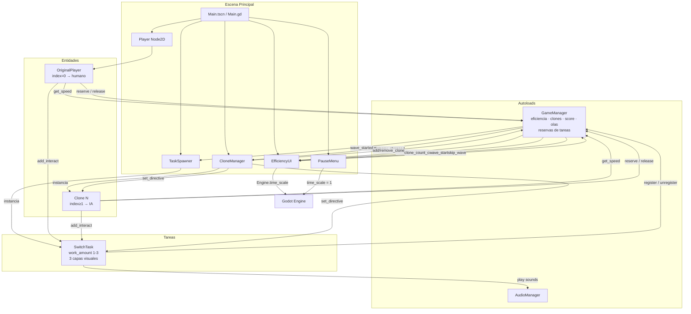
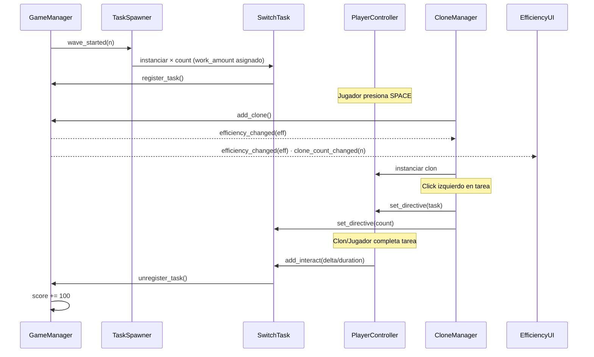

# Plan: README.md de OverSplit


### 1. Cabecera
- Título: **OverSplit**
- Tagline: *"Cuantas más cosas haces al mismo tiempo, peor las haces."*
- Motor: Godot 4.6.1 · GDScript · GL Compatibility

---

### 2. Concepto del juego
El jugador puede clonarse para cubrir múltiples tareas en paralelo, pero cada clon reduce la eficiencia global de todos (velocidad, coordinación). El juego exige decidir conscientemente cuántos clones valen la pena para cada situación.

---

### 3. Controles

| Acción | Input |
|---|---|
| Mover jugador | `WASD` / Flechas |
| Crear clon | `SPACE` |
| Eliminar último clon | `Q` |
| Interactuar con tarea | `E` |
| Asignar clon a tarea | `Click izquierdo` sobre el cuadrado |
| Quitar directiva | `Click derecho` sobre el cuadrado |
| Pausar / Reanudar | `ESC` o botón HUD |

---

### 4. Mecánicas principales

#### Sistema de Clones
- Máximo **6 entidades** (jugador + 5 clones).
- Clones se mueven con IA hacia la tarea más cercana disponible.
- Colores: Cyan, Amarillo, Verde, Naranja, Magenta.
- Al crear un clon: flash blanco en todos los sprites.

#### Fórmula de Eficiencia
```
eficiencia = max(0.1, 1.0 - (n - 1) × 0.156)
```
| Clones (n) | Eficiencia | Velocidad (px/s) |
|---|---|---|
| 1 | 100% | 180 |
| 2 | 84% | 152 |
| 3 | 69% | 124 |
| 4 | 53% | 95 |
| 5 | 38% | 68 |
| 6 | 22% | 40 |

Solo afecta **velocidad de movimiento**. El tiempo de interacción es fijo (2.5 s base), pero múltiples clones sobre el mismo objetivo acumulan progreso simultáneamente.

#### Interacción colaborativa
- La barra de progreso vive en el **objetivo** (`SwitchTask.interact_progress`), no en el jugador.
- Cada contribuyente añade `delta / 2.5s` por frame; cuantos más clones interactúen con el mismo objetivo, más rápido se completa.

#### Sistema de Directivas (click)
- **Click izquierdo** sobre un cuadrado: asigna 1 clon más a ese objetivo (cada click suma 1). Los clones más cercanos tienen prioridad.
- **Click derecho**: limpia todas las directivas del objetivo.
- El label `>> N` cyan indica cuántos clones tienen directiva activa sobre esa tarea.

#### Comportamiento de Empuje
- Los clones en movimiento empujan a los que están interactuando al chocar.
- El clon empujado **orbita alrededor del objetivo** sin salirse del radio de interacción (28 px).
- La fuerza de empuje tiene cap de 50 px/s y se amortigua rápidamente.

---

### 5. Sistema de Oleadas

| Parámetro | Fórmula |
|---|---|
| Intervalo entre olas | `max(7s, 20s − ola × 1.3s)` |
| Tareas por ola | `min(ola + 1, 8)` |
| Timeout por tarea | `rand(max(5, 12 − ola×0.6), max(8, 22 − ola×1.0))` |
| Bonus por ola limpia | `ola × 500 pts` |
| Puntos por tarea | 100 pts |

#### Dificultad progresiva
| Ola | Etiqueta |
|---|---|
| 1–2 | Fácil |
| 3–5 | Normal |
| 6–9 | Difícil |
| 10+ | CAOS |

---

### 6. Sistema Visual de Tareas (jerárquico)

Las tareas comunican información mediante 3 capas visuales:

#### Capa Base — siempre activa
- **Tamaño**: crece con `work_amount` (1x / 1.35x / 1.7x) y encoge al completarse.
- **Glow del borde**: más brillante cuanto más trabajo queda; color = versión clara del color de la tarea.

#### Capa Estado — condicional (tiempo < 35%)
- Activa **pulso de urgencia** en la escala del cuadrado.
- Borde cambia a **naranja** (<35% tiempo) → **rojo pulsante** (<15% tiempo).

#### Capa Decisión — inteligente
- **Badge dorado ①②③** aparece cuando los clones asignados son menos que los recomendados para terminar a tiempo.
- Se oculta si el jugador ya asignó una directiva manual.

#### `work_amount` por ola
| Ola | Valores posibles |
|---|---|
| 1–3 | Solo 1 |
| 4–6 | 1 ó 2 |
| 7+ | 1, 2 ó 3 |

---

### 7. HUD

- Barra de eficiencia: verde (>60%) → amarillo (35–60%) → rojo (<35%).
- Vibración del panel cuando eficiencia < 25%.
- Contador de clones, score, ola, dificultad, timer de próxima ola.
- **Botón Vel**: cicla x1 → x1.5 → x2 (usa `Engine.time_scale`). Color: gris → amarillo → naranja.
- **Botón Saltar ola**: activo solo cuando no hay tareas pendientes.
- **Botón Pausa / ESC**.

---

### 8. Sistema de Audio (procedural)

Sin archivos de audio externos. Todo sintetizado con `AudioStreamGenerator`:

| Evento | Onda |
|---|---|
| Crear clon | Sine sweep 280→720 Hz |
| Eliminar clon | Sine sweep 520→160 Hz |
| Tarea completada | Dos notas sine (C5 + E5) |
| Tarea fallida | Square wave 110 Hz |
| Nueva ola | Arpegio de 3 notas sine |
| Inicio de interacción | Noise burst corto |

Pool de 10 `AudioStreamPlayer` reutilizables.

---

### 9. Menú principal y Pausa

- **MainMenu**: pantalla de inicio con botón Jugar.
- **PauseMenu**: accesible con `ESC` o botón HUD. Opciones: Reanudar / Volver al menú. Al pausar, `Engine.time_scale` se resetea a 1.0 automáticamente.

---

### 10. Estructura del proyecto

```
OverSplit/
├── project.godot                  ← Config, inputs, autoloads
├── scenes/
│   ├── Main.tscn                  ← Escena de juego principal
│   ├── MainMenu.tscn              ← Menú de inicio
│   ├── Player.tscn                ← Jugador / clon (CharacterBody2D)
│   ├── SwitchTask.tscn            ← Tarea interactuable
│   └── ui/
│       ├── EfficiencyUI.tscn      ← HUD completo
│       └── PauseMenu.tscn         ← Menú de pausa
└── scripts/
    ├── AudioManager.gd            ← Autoload: síntesis de audio procedural
    ├── GameManager.gd             ← Autoload: estado global, señales, reservas
    ├── Main.gd                    ← Bootstrap: conecta CloneManager con jugador
    ├── MainMenu.gd                ← Lógica del menú principal
    ├── PlayerController.gd        ← Movimiento + interacción (humano o IA) + empuje orbital
    ├── CloneManager.gd            ← Instancia/elimina clones, directivas por click
    ├── SwitchTask.gd              ← Tarea: 3 capas visuales, progreso compartido
    ├── TaskSpawner.gd             ← Spawner por ola con work_amount progresivo
    ├── EfficiencyUI.gd            ← HUD reactivo + botones vel/skip
    └── PauseMenu.gd               ← Pausa con reset de time_scale
```

---

### 11. Arquitectura — Diagrama de dependencias



---

### 12. Flujo de señales



---

### 13. Constantes clave (`GameManager.gd`)

| Constante | Valor | Descripción |
|---|---|---|
| `MAX_CLONES` | 6 | Máximo entidades totales |
| `BASE_SPEED` | 180.0 px/s | Velocidad base |
| `BASE_INTERACT_TIME` | 2.5 s | Duración base de interacción |
| `WAVE_INTERVAL` | 20.0 s | Intervalo inicial entre olas |
| `MIN_WAVE_INTERVAL` | 7.0 s | Intervalo mínimo entre olas |
| `MAX_TASKS_PER_WAVE` | 8 | Máximo de tareas por ola |

---

## Verificación / DoD

| Verificación |
|---|
| El archivo existe en la raíz del proyecto |
| Todos los valores de constantes y fórmulas coinciden con el código actual |
| Los diagramas Mermaid renderizan sin errores |
| La tabla de eficiencia refleja la fórmula `1.0 - (n-1) × 0.156` |
| La estructura de archivos lista todos los scripts y escenas existentes |
