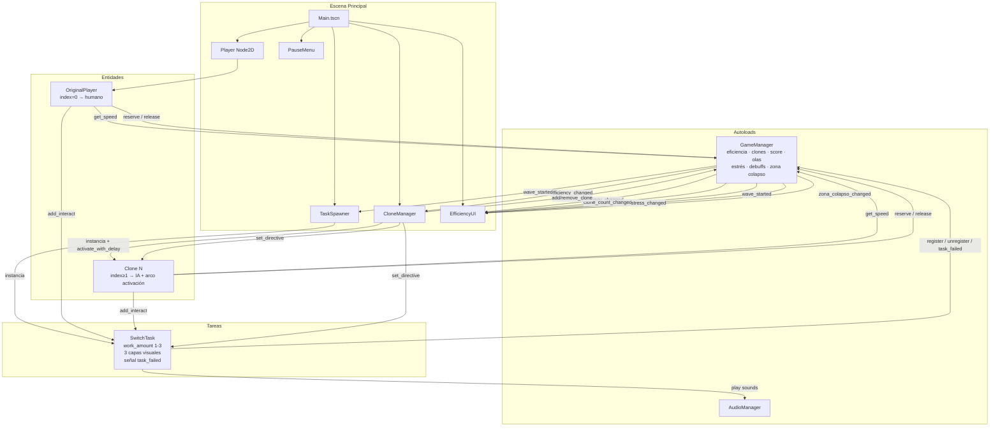
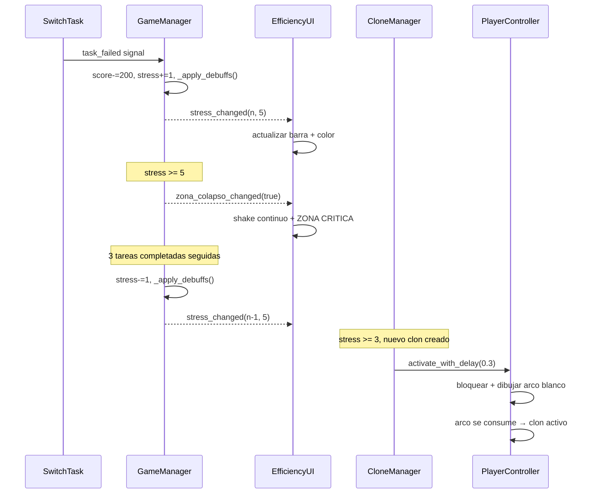

# OverSplit — v9.0 beta
(v9.0 beta)

El jugador puede clonarse para cubrir múltiples tareas en paralelo, pero cada clon reduce la eficiencia global de todos (velocidad, coordinación). El juego exige decidir conscientemente cuántos clones valen la pena para cada situación. Fallar tareas acumula estrés que degrada progresivamente el rendimiento hasta llegar a la Zona de Colapso.

---

## Controles

| Acción | Input |
|---|---|
| Mover jugador | `WASD` / Flechas |
| Crear clon | `SPACE` |
| Eliminar último clon | `Q` |
| Interactuar con tarea | `E` |
| Asignar clon a tarea | `Click izquierdo` sobre el cuadrado |
| Quitar directiva | `Click derecho` sobre el cuadrado |
| Pausar / Reanudar | `ESC` o botón HUD |

---

## Mecánicas principales

### Sistema de Clones

- Máximo **6 entidades** (jugador + 5 clones).
- Los clones se mueven con IA hacia la tarea más cercana disponible.
- Colores: Cyan, Amarillo, Verde, Naranja, Magenta.
- Al crear un clon: flash blanco en todos los sprites.
- Si el debuff de reacción está activo, el clon muestra un **arco circular blanco** que se consume antes de activarse.

### Fórmula de Eficiencia

```
eficiencia = max(0.1,  1.0 − (n − 1) × 0.156)
```

| Clones (n) | Eficiencia | Velocidad (px/s) |
|:---:|:---:|:---:|
| 1 | 100% | 180 |
| 2 | 84% | 152 |
| 3 | 69% | 124 |
| 4 | 53% | 95 |
| 5 | 38% | 68 |
| 6 | 22% | 40 |

Solo afecta la **velocidad de movimiento**. Los debuffs de estrés modifican adicionalmente velocidad y eficiencia.

### Interacción colaborativa

- La barra de progreso vive en el **objetivo** (`SwitchTask.interact_progress`), no en el jugador.
- Cada contribuyente añade `delta / 2.5s` por frame; cuantos más clones interactúen con el mismo objetivo, más rápido se completa.

### Sistema de Directivas (click)

- **Click izquierdo** sobre un cuadrado: asigna 1 clon más a ese objetivo. Los clones más cercanos tienen prioridad.
- **Click derecho**: limpia todas las directivas del objetivo.
- El label `>> N` cyan indica cuántos clones tienen directiva activa.

### Comportamiento de Empuje

- Los clones en movimiento empujan a los que están interactuando al chocar.
- El clon empujado **orbita alrededor del objetivo** sin salirse del radio de interacción (28 px).
- La fuerza de empuje tiene cap de 50 px/s y se amortigua rápidamente.

---

## Sistema de Estrés y Debuffs

Fallar una tarea aplica penalizaciones acumulativas. Completar 3 tareas seguidas sin fallar reduce 1 punto de estrés.

### Penalización por fallo

```
Fallo de tarea → −200 score + +1 estrés + debuff acumulativo
```

### Tabla de debuffs

| Estrés | Debuff aplicado |
|:---:|---|
| 1 | −5% velocidad base |
| 2 | −1s en el timeout de tareas futuras |
| 3 | Nuevos clones tardan **0.3s** en activarse (arco circular visible) |
| 4 | −10% eficiencia global |
| 5 | **Zona de Colapso activa** |

### Zona de Colapso (estrés = 5)

- Los clones tienen probabilidad de ignorar su target e ir a uno aleatorio.
- Las tareas nuevas tienen `work_amount` mínimo forzado a 2.
- El HUD muestra **"!! ZONA CRITICA !!"** en rojo con shake continuo.
- No hay game over — la presión es el castigo.

### Recuperación

Completar **3 tareas consecutivas** sin fallar elimina 1 punto de estrés automáticamente.

---

## Sistema de Oleadas

| Parámetro | Fórmula |
|---|---|
| Intervalo entre olas | `max(7s, 20s − ola × 1.3s)` |
| Tareas por ola | `min(ola + 1, 8)` |
| Timeout por tarea | `rand(max(3, 12 − ola×0.6 − stress_penalty), max(5, 22 − ola×1.0 − stress_penalty))` |
| Bonus por ola limpia | `ola × 500 pts` |
| Puntos por tarea | 100 pts |

### Dificultad progresiva

| Ola | Etiqueta |
|:---:|:---:|
| 1–2 | Fácil |
| 3–5 | Normal |
| 6–9 | Difícil |
| 10+ | CAOS |

---

## Sistema Visual de Tareas (jerárquico)

### Capa Base — siempre activa
- **Tamaño**: crece con `work_amount` (1x / 1.35x / 1.7x) y encoge al completarse.
- **Glow del borde**: más brillante cuanto más trabajo queda.

### Capa Estado — condicional (tiempo < 35%)
- **Pulso de urgencia** en la escala del cuadrado.
- Borde cambia a **naranja** (<35%) → **rojo pulsante** (<15%).

### Capa Decisión — inteligente
- **Badge dorado ①②③** cuando los clones asignados son menos que los necesarios para terminar a tiempo.
- Se oculta si el jugador ya asignó una directiva manual.

### `work_amount` por ola

| Ola | Valores posibles |
|:---:|:---:|
| 1–3 | Solo 1 |
| 4–6 | 1 ó 2 |
| 7+ | 1, 2 ó 3 |
| Zona Colapso | Mínimo 2 |

---

## HUD

- Barra de eficiencia: verde (>60%) → amarillo (35–60%) → rojo (<35%).
- **Barra de estrés**: verde (0) → amarillo (1–2) → naranja (3–4) → rojo crítico (5).
- Vibración del panel al eficiencia < 25%; shake continuo en Zona de Colapso.
- Contador de clones, score, ola, dificultad, timer de próxima ola.
- **Botón Vel**: cicla x1 → x1.5 → x2. Color: gris → amarillo → naranja.
- **Botón Saltar ola**: activo solo sin tareas pendientes.
- **Botón Pausa / ESC**.

---

## Sistema de Audio (procedural)

Sin archivos externos. Todo sintetizado con `AudioStreamGenerator`:

| Evento | Onda |
|---|---|
| Crear clon | Sine sweep 280 → 720 Hz |
| Eliminar clon | Sine sweep 520 → 160 Hz |
| Tarea completada | Dos notas sine (C5 + E5) |
| Tarea fallida | Square wave 110 Hz |
| Nueva ola | Arpegio de 3 notas sine |
| Inicio de interacción | Noise burst corto |

Pool de 10 `AudioStreamPlayer` reutilizables.

---

## Menú y Pausa

- **MainMenu**: pantalla de inicio con botón Jugar.
- **PauseMenu**: accesible con `ESC` o botón HUD. Al pausar, `Engine.time_scale` se resetea a 1.0.

---

## Estructura del proyecto

```
OverSplit/
├── project.godot
├── scenes/
│   ├── Main.tscn
│   ├── MainMenu.tscn
│   ├── Player.tscn
│   ├── SwitchTask.tscn
│   └── ui/
│       ├── EfficiencyUI.tscn
│       └── PauseMenu.tscn
└── scripts/
    ├── AudioManager.gd         ← Autoload: síntesis de audio procedural
    ├── GameManager.gd          ← Autoload: estado global, estrés, debuffs, señales
    ├── Main.gd
    ├── MainMenu.gd
    ├── PlayerController.gd     ← Movimiento + interacción + arco de activación
    ├── CloneManager.gd         ← Clones, directivas, activate_with_delay
    ├── SwitchTask.gd           ← 3 capas visuales, señal task_failed
    ├── TaskSpawner.gd          ← Spawner con work_amount y zona colapso
    ├── EfficiencyUI.gd         ← HUD: eficiencia, estrés, vel, skip
    └── PauseMenu.gd
```

---

## Arquitectura



---

## Flujo de estrés



---

## Constantes clave (`GameManager.gd`)

| Constante | Valor | Descripción |
|---|---|---|
| `MAX_CLONES` | 6 | Máximo de entidades totales |
| `BASE_SPEED` | 180.0 px/s | Velocidad base |
| `BASE_INTERACT_TIME` | 2.5 s | Duración base de interacción |
| `WAVE_INTERVAL` | 20.0 s | Intervalo inicial entre olas |
| `MIN_WAVE_INTERVAL` | 7.0 s | Intervalo mínimo entre olas |
| `MAX_TASKS_PER_WAVE` | 8 | Máximo de tareas por ola |
| `MAX_STRESS` | 5 | Umbral de Zona de Colapso |
